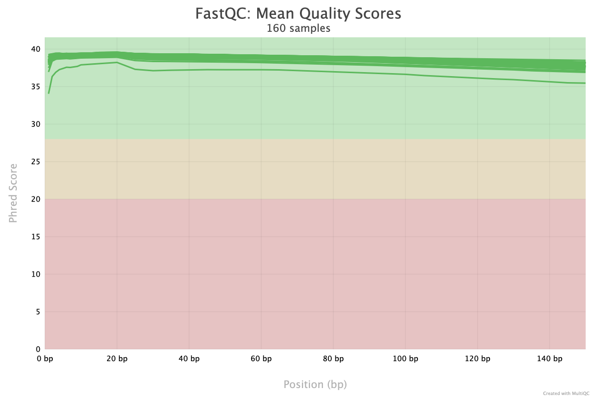
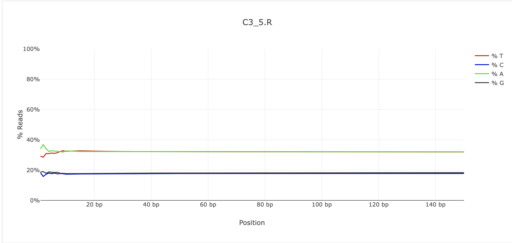
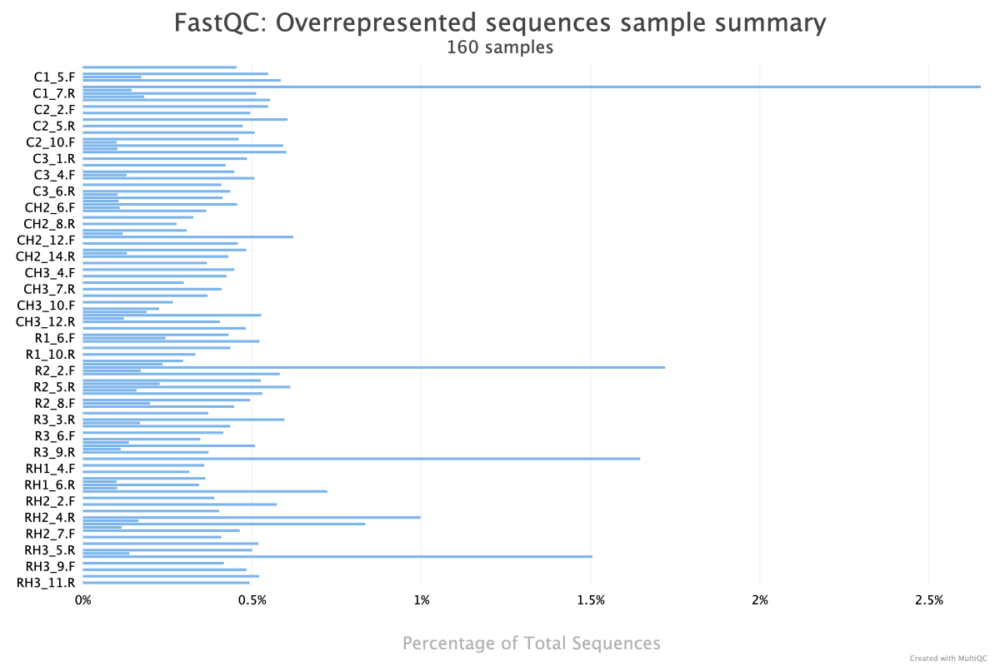

# ROD CADO Collaborative Project Analysis
Home for analysis steps and notes for ROD CADO project

Author: PLOMEE 

Last edited: 20250319 MG 

**TABLE OF CONTENTS**
1. [Set up](#1-set-up)
2. [QC on raw reads](#2-quality-check-of-raw-reads-with-fastqc-and-multiqc)
3. [Quality trimming & filtering](#3-trimming-and-filtering)
4. [QC on clean reads](#4-quality-check-of-clean-reads-with-fastqc-and-multiqc)
5. []()
6. []()
7. []()
8. []()


## 1. Set up
Data uploaded & analyzed on KITT. User logged in via ssh before following steps were completed.

### Working directory
```
/home/Shared_Data/ROD_CADO/
```

### Link data into working directory & rename with shorter name
```
mkdir raw_seq
cd raw_seq

#command structure:  ln –s <location of file> <newfilename>

#forward read
ln -s /RAID_STORAGE2/Raw_Data/ASMFC_RISG_JUV_CADO/01.RawData/R1_10_22JOD/R1_10_22JOD_CKDN240007833-1A_227C73LT4_L8_1.fq.gz R1_10.F.fq.gz  

#reverse read
ln -s /RAID_STORAGE2/Raw_Data/ASMFC_RISG_JUV_CADO/01.RawData/R1_10_22JOD/R1_10_22JOD_CKDN240007833-1A_227C73LT4_L8_2.fq.gz R1_10.R.fq.gz 
```

Some samples, had more than 2 fastq files because of the way the samples were split across sequencing lanes. Those samples needed the multiple reads from different lanes to be concatenated into a single fq.gz before moving forward. See example below.
```
#still run within the 'raw_seq' directory

#forward read
cat /RAID_STORAGE2/Raw_Data/ASMFC_RISG_JUV_CADO/01.RawData/R1_12_22JOD/R1_12_22JOD_CKDN240007835-1A_227C73LT4_L8_1.fq.gz /RAID_STORAGE2/Raw_Data/ASMFC_RISG_JUV_CADO/01.RawData/R1_12_22JOD/R1_12_22JOD_CKDN240007835-1A_227C73LT4_L4_1.fq.gz > R1_12.F.fq.gz 

#reverse read
cat /RAID_STORAGE2/Raw_Data/ASMFC_RISG_JUV_CADO/01.RawData/R1_12_22JOD/R1_12_22JOD_CKDN240007835-1A_227C73LT4_L8_2.fq.gz /RAID_STORAGE2/Raw_Data/ASMFC_RISG_JUV_CADO/01.RawData/R1_12_22JOD/R1_12_22JOD_CKDN240007835-1A_227C73LT4_L4_2.fq.gz > R1_12.R.fq.gz 
```

#### Check out the data
Now we have all of our raw sequencing reads within the /home/Shared_Data/ROD_CADO/raw_seq directory (either as symbolic links or concatenated files).
```
#count all files in raw_seq directory (should be 160)
ls -1 *.fq.gz | wc -l

#look at all files in directory plus additional info (long list)
ls -l 

#or on KITT you can use 'll'
```
This command helped identify that 2 files were miss labeled as .fg.gz instead of .fq.gz (used 'mv CH3_2.R.fg.gz CH3_2.R.fq.gz' to address the issue)

### Downloading Bioconda (skip this if Bioconda is already downloaded)
We skipped this and moved on to creating a conda environment. These instructions may have changed.
```
# downloading Miniconda software
$ wget https://repo.anaconda.com/miniconda/Miniconda3-latest-Linux-x86_64.sh
chmod +x Miniconda3-latest-Linux-x86_64.sh
./Miniconda3-latest-Linux-x86_64.sh

# restarting window with source command
source ~/.bashrc

# adding different channels
conda config --add channels defaults
	# should get: "warning: 'defaults' already in 'channels' list, moving to the top"
conda config --add channels bioconda
conda config --add channels conda-forge

# to see if this worked with cat command
cat .condarc
```

### Create and acitvate a conda environment with ROD_CADO.yml
This environment contains the packages we'll need to progress through data analysis. Conda environments are helpful for collaborative work and ensuring reproducibility.
```
#create an environment called ROD_CADO from Jon's .yml file
conda env create -f ROD_CADO.yml

#look at all conda environments
conda env list

#move into our new conda env
conda activate ROD_CADO   #once successfully in the env, (base) will change to (ROD_CADO)
```

### Github repository at [MarineEvoEcoLab/ROD_CADO](https://github.com/MarineEvoEcoLab/ROD_CADO)


## 2. Quality check of raw reads with fastqc and multiqc
FastQC is a program designed to visualize the quality of high throughput sequencing datasets. The report will highlight any areas where the data looks unusual or unreliable. 
```
mkdir rawreads_fastqc_results/
cd rawreads_fastqc_results/
fastqc -o /home/Shared_Data/ROD_CADO/raw_seq/rawreads_fastqc_results/ ../*F.fq.gz
fastqc -o /home/Shared_Data/ROD_CADO/raw_seq/rawreads_fastqc_results/../*R.fq.gz
```

**Since this takes a while, we used *tmux***
tmux is beneficial to be able to disconnect from terminal and not disrupt fastqc. See general tmux syntax below.

**[Easy Guide to tmux](https://hamvocke.com/blog/a-quick-and-easy-guide-to-tmux/)**

```
#create a new session and run desired command
tmux new -s my_session
your_command

#to detach from the session
Ctrl + b, then d 
##or type
tmux detach

#list tmux sessions
tmux ls

#reattach to session
tmux attach -t my_session

#kill session (if needed)
tmux kill-session -t my_session
```

### Troubleshooting 
There were only 154 .fastqc.zip files in the rawreads_fastqc_results folder after we ran fastqc. There should have been 160. We had to do some troubleshooting to figure out which 6 reads were missing from the fastqc analysis. To start, we made a list of the file names in raw_seq with the following code: 

```
cd raw_seq
for file in *.fq.gz; do echo "${file%.fq.gz}"; done > rawreads_filenames.txt
head rawreads_filenames.txt
```

And did the same for the file names in rawreads_fastqc_results 
```
cd rawreads_fastqc_results
for file in *fastqc.zip; do echo "${file%_fastqc.zip}"; done > fastqc_filenames.txt
head fastqc_filenames.txt
```

Once we had both files with the file names, we compared the file names in each of these txt files and find the missing reads!
```
cd raw_seq
grep -Fxv -f rawreads_fastqc_results/fastqc_filenames.txt rawreads_filenames.txt > missing_names.txt
cat missing_names.txt
```
Below are the missing fastqc files!
```
CH3_10.F  ****
CH3_2.F
CH3_2.R
R1_5_F
R1_5_R
RH3_8.R ****
```

Let's re-do the fastqc analysis for these files with the following code:
```
fastqc -o /home/Shared_Data/ROD_CADO/raw_seq/rawreads_fastqc_results/ ../CH3_10.F.fq.gz
```

Most of the missing samples were misnamed, renamed then successfully run through fastqc!

However, `CH3_10.F` and `RH3_8.R` showed the following message when the line above was run. 
```
Approx 95% complete for CH3_10.F.fq.gz
Failed to process file CH3_10.F.fq.gz
uk.ac.babraham.FastQC.Sequence.SequenceFormatException: Ran out of data in the middle of a fastq entry.  Your file is probably truncated
	at uk.ac.babraham.FastQC.Sequence.FastQFile.readNext(FastQFile.java:179)
	at uk.ac.babraham.FastQC.Sequence.FastQFile.next(FastQFile.java:125)
	at uk.ac.babraham.FastQC.Analysis.AnalysisRunner.run(AnalysisRunner.java:76)
	at java.base/java.lang.Thread.run(Thread.java:829)
```

After looking into the raw sequence files on RAID_STORAGE2, these reads were concatonated from multiple lanes. It's likely that on the original transfer of files, 1 or 2 lanes was left off of the .fq.gz file. Pulled those files again with the `cat /pathtoreads/read_L#.fq.gz /pathtoreads/read_L#.fq.gz /pathtoreads/read_L#.fq.gz > readname.fq.gz` command and re-ran the fastqc line. This worked!

**Let's triple check that we have 160 fastqc files**
```
ls -1 *fastqc.zip | wc -l
160

ls -1 *.html | wc -l
160
```

### Multiqc report
Ran multiqc to generate a readable report to investigate the quality of the sequence data. Ran in the directory with the fastqc output files.

```
cd rawreads_fastqc_results
multiqc .
```

The multiqc command generates `multiqc_data` directory and `multiqc_report.html`. The .html report file can be transferred to local computer or to github and visualized on a web browser. 

### Reviewing multiqc report

Upon first look at the multiqc report there appeared to be some potential issues with the way a couple of files were concatonated leading to uneven sequence counts between fwd and rev (which we could expect to share similar read counts). JMG re-concatonated `R1_12.R ` and MEG reconcatonated both `CH2_12.F` and `CH2_12.R`. Then fastqc analysis was rerun on those samples and a new multiqc report was generated called `2_rawreads_multiqc_report.html`. This resolved differences in sequence lengths/duplication % between fwd/rev reads.

#### Quality Score per base
Overall, there is high quality across the samples and along the read lengths with a slight drop in quality at the beginning and end of the reads. C1_6.R had lower quality scores across the read.


#### Per base sequence content
Here, we can see that there is a bit of noise in the first ~10bp of the read. This pattern was common across most all of the samples. This is really normal as the sequencer settles in and error checking ramps up in the initial part of the read. We'll trim off the first 10bp of all of the reads before moving forward with analyses.


#### Overrepresented sequences sample summary 
C1_6.R (which was the sample with lower quality scores than the rest) had the highest % of top overrepresented sequence. Still looks overall really good.



## 3. Trimming and filtering
Trimming with dDocent vs. trimming outside of dDocent. Since data looks relatively good and we don't have any nonstandard concerns, we can proceed with trimming in dDocent just to make it as straightforward as possible. 
Instead of running everything all at once (as we did below), we can also run one step at a time and check results after each step!

**[dDocent website](https://ddocent.com) with more info!**

```
cd Shared_Data/ROD_CADO
conda activate ROD_CADO
mkdir analysis
cd analysis
ln -s ../dDocent_ngs .  #link dDocent file into this new analysis directory
ln -s ../raw_seq/*.fq.gz #link raw seq files into analysis directory
ln -s ~/eager_obj1b/Genome/masked.* refernce.fasta #link new haplotig masked genome into directory and name it reference.fasta (from JMG previous directory)
#nano config.file #dDocent always needs a `config.file` to run with instructions on how to complete the run -OR- you can do interactive prompts (we did interactive prompts) 
./dDocent_ngs

# prompts below come up
processors: 48
trim?: yes
perform assembly?: yno
map reads? yes
new parameters for BWA? no 
call SNPS? yes
enter email # this will run a while!
ctrl+z 
bg
disown -h 
top #shows you programs running currently - press q to leave
tail temp.LOG #shows you progress of read trimming
```


## 4. Quality check of clean reads with fastqc and multiqc


#### Next steps chatter from 20250305
- review new multiqc report
- trim the beginning noise from first 10 bp of reads (see plot)
- Can use fastp to trim data "manually" or you can run it through dDocent to trim reads
- re-run quality check